# Architecture

Complete architecture of the AI HR Helpdesk Assistant, as Mermaid diagrams.  
Companion to the [README](./README.md) local-setup guide.

---

## 1. System overview

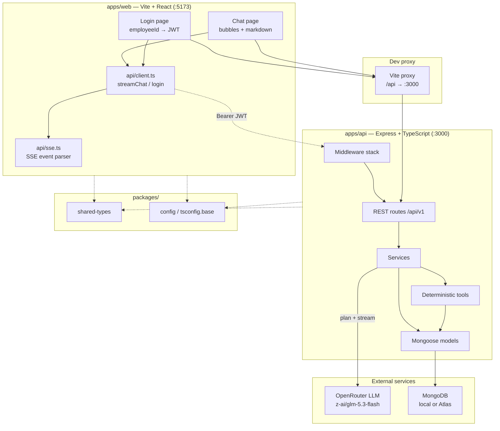

---

## 2. Monorepo layout

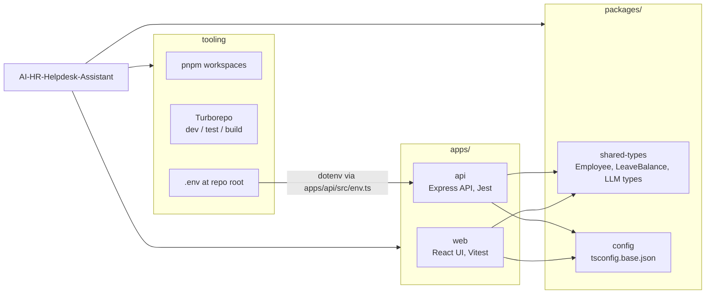

---

## 3. HTTP middleware & routes

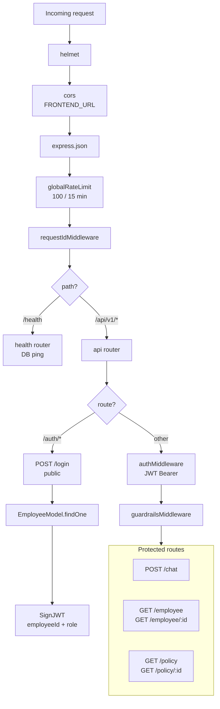

---

## 4. Auth & role model

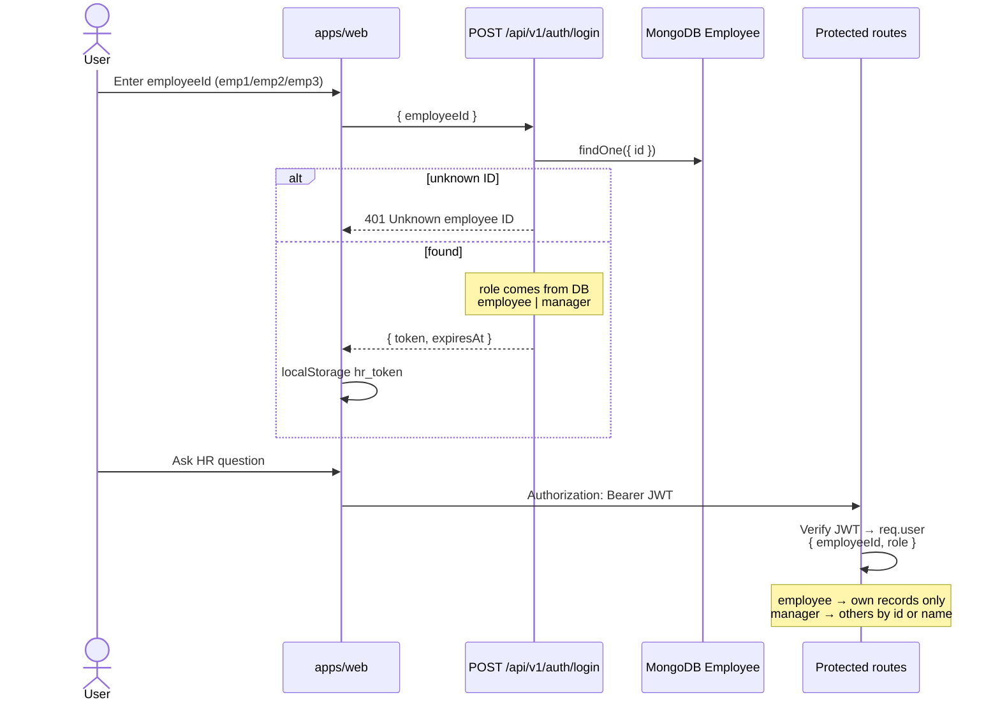

---

## 5. Streaming chat pipeline

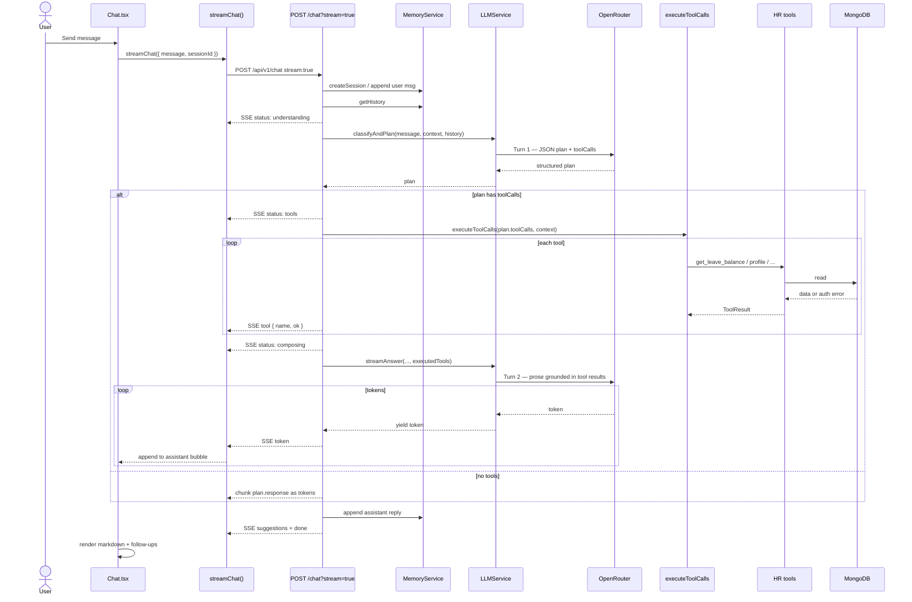

---

## 6. LLM turns & prompts

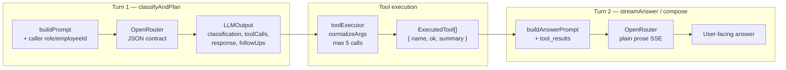

---

## 7. Deterministic tools

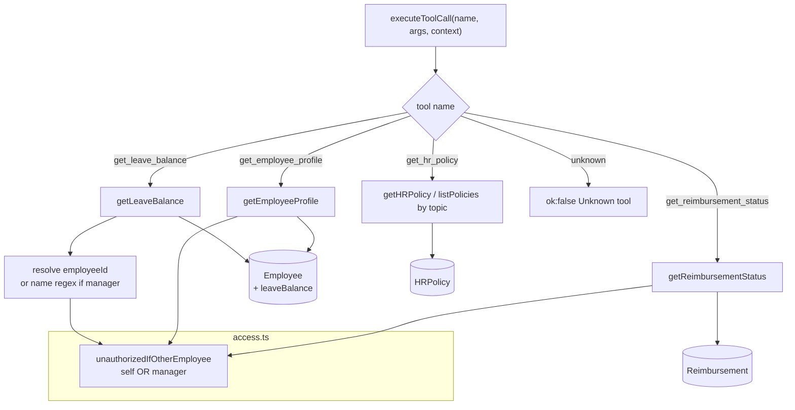

### Tool → data mapping

| Tool | Reads | Auth |
|------|--------|------|
| `get_leave_balance` | `Employee.leaveBalance` (+ optional name lookup) | Self, or any employee if `role=manager` |
| `get_employee_profile` | `Employee` fields | Same |
| `get_reimbursement_status` | `Reimbursement` by `employeeId` | Same |
| `get_hr_policy` | `HRPolicy` by id or topic list | Any authenticated user |

---

## 8. Data model

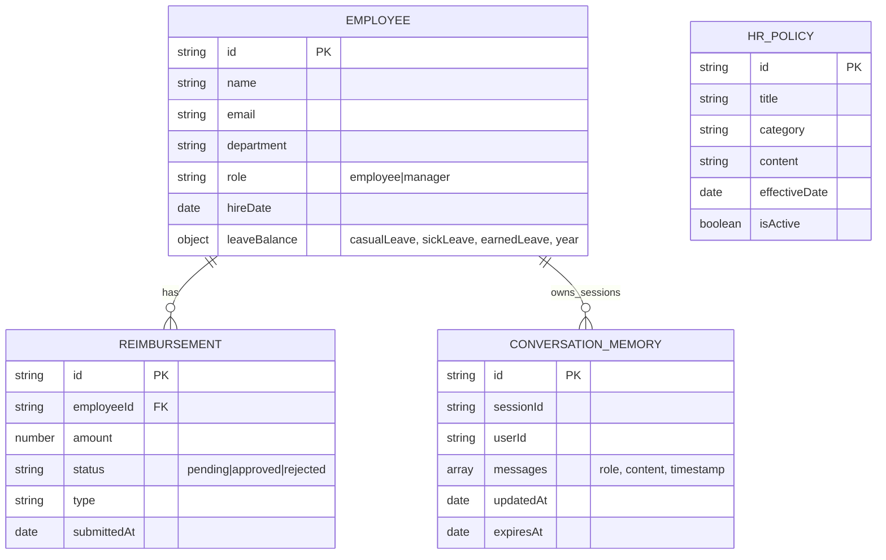

Leave quotas are **embedded** on `Employee` (not a separate collection). Seed data: `emp1` Alice (employee), `emp2` Bob (manager), `emp3` Carol (employee).

---

## 9. Frontend structure

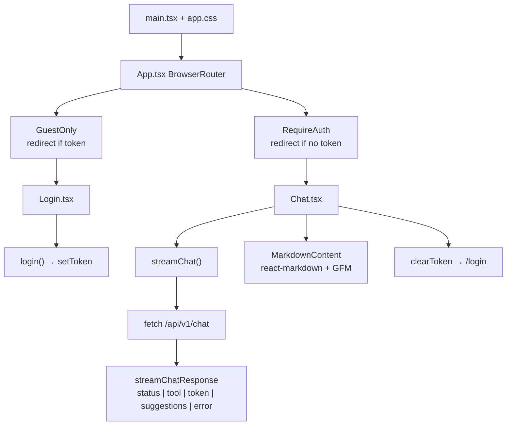

---

## 10. Non-streaming chat path

Same two-turn logic as streaming, but a single JSON response:

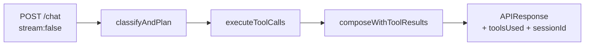

The web UI uses **streaming only**; the non-stream path remains for API clients.

---

## 11. Observability & safety

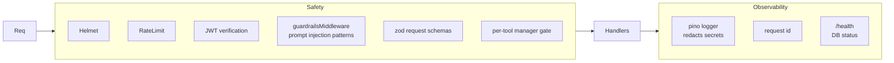

---

## Legend

| Symbol | Meaning |
|--------|---------|
| Solid arrow | Runtime call / data flow |
| Dashed arrow | Type or config dependency |
| SSE | Server-Sent Events (`text/event-stream`) |
| Turn 1 / Turn 2 | Separate OpenRouter completions |

For how to run this stack locally, see [README.md](./README.md).
